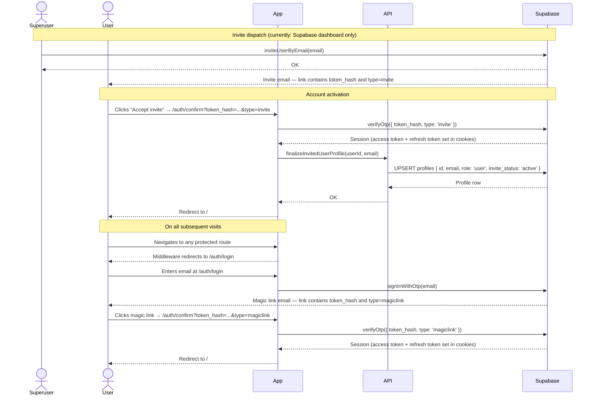

# Flow 00: Account Creation

## Overview

Climbing Coach uses an invite-only signup model. There is no public registration page. A superuser sends an invite via Supabase, the invited user clicks the link in their email, and the application activates their account on arrival at `/auth/confirm`. The user then accesses the app using an email magic link on all subsequent visits — no password is required or stored.

This flow has two actors: the **superuser** who initiates the invite, and the **invited user** who completes it. The two sides are independent and asynchronous.

At the time of writing, the invite must be sent from the Supabase dashboard directly. The in-app invite UI (`DEV-2`) and `POST /api/invites` route (`API-0`) are not yet implemented.

### Required Supabase configuration

Supabase distinguishes between two URL settings:

- **Site URL** — the default redirect destination when no explicit `redirectTo` is provided. This should remain the app root (e.g. `http://localhost:3000`). It should not be set to a callback path.
- **Allowed Redirect URLs** — an explicit allowlist of permitted `redirectTo` destinations. Any URL passed as `redirectTo` (including in invite links and API calls) must appear here.

The invite flow must redirect to `/auth/confirm` (see `AUTH-8`), not `/auth/callback`. Add the following to the **Allowed Redirect URLs** list in **Authentication > URL Configuration** (`MANUAL-1`):

| Environment | URL to add |
|---|---|
| Local development | `http://localhost:3000/auth/confirm` |
| Staging / production | `https://<your-deployed-domain>/auth/confirm` |

Because the Supabase dashboard does not expose a per-invite redirect field, the invite email template must also be updated to route to `/auth/confirm` (`MANUAL-2`). Once `API-0` is implemented, `inviteUserByEmail` will pass `options.redirectTo` explicitly.

### Why `/auth/confirm` and not `/auth/callback`

The existing `/auth/callback` route uses `exchangeCodeForSession(code)`, which handles OAuth PKCE codes delivered as `?code=` query parameters. Supabase's invite (and password recovery) flow uses a different mechanism: it delivers a `?token_hash=...&type=invite` pair and requires `verifyOtp({ token_hash, type })`. These are distinct server-side calls and must be handled by separate routes. `AUTH-8` adds the `/auth/confirm` route for OTP-based flows.

---

## Sequence diagram

---

## Journey map

| Stage | User action | System response | Friction / gap |
|---|---|---|---|
| **Receive invite** | Opens email from Supabase | Generic Supabase-branded invite email with an "Accept invite" button | Email is sent from Supabase's default address with Supabase branding. There is no app-specific copy, no mention of what Climbing Coach is, and no indication of who sent the invite. |
| **Click invite link** | Clicks "Accept invite" | Browser opens `/auth/confirm?token_hash=...&type=invite` | User has no visibility of what is happening. No loading state is shown during the confirmation. |
| **Session established** | — (automatic) | `verifyOtp` runs; cookies are set; profile row is upserted | If verification fails the user is redirected to `/auth/login?error=confirm_failed` with no explanation of what went wrong or what to do next. |
| **Land on home** | Redirected to `/` | Home dashboard renders with empty state | The user has an active session. No further setup is required. |
| **Return visit** | Opens app after session has expired, navigates to any protected route | Middleware redirects to `/auth/login` | User enters their email and receives a magic link. |
| **Magic link sign-in** | Clicks magic link in email | `/auth/confirm` verifies the OTP and establishes a session; redirects to `/` | Token valid for Supabase's default OTP expiry (typically 1 hour). If expired, the user re-enters their email on `/auth/login`. |

---

## Gap summary

### Accepted / by design
- **Magic link login (no password).** Users authenticate exclusively via email magic links — both on first invite and on all return visits. No password is required or stored. `AUTH-9` implements the magic link login form.
- **Password setup via Supabase reset flow removed.** The original approach of setting a password via "Forgot password" was replaced by magic link authentication — simpler and consistent with the invite flow.

### Resolved
- **`/auth/confirm` OTP route (`AUTH-8`).** Implemented with support for invite-type (profile finalization + redirect) and recovery-type (redirect to change-password page) flows. Handles safe `next` parameter validation and structured error logging.

### Open
- **No in-app invite sending.** Invites must currently be sent directly from the Supabase dashboard. The `/dev` invite UI (`DEV-2`) is not yet built. (`POST /api/invites` is implemented as `API-0`.)
- **Magic link login not yet implemented.** `AUTH-9` (replace password form with magic link entry) is pending. Until then the login page has a password form that no user has credentials for.
- **Generic invite email.** The email is sent with Supabase default branding and copy. Customisation requires a Supabase Pro plan or custom SMTP configuration.
- **Silent confirmation failures.** If `verifyOtp` or profile finalization fails, the user is redirected to `/auth/login?error=confirm_failed` with no explanation in the UI.
- **No logout surface.** Once logged in, the user has no way to log out. `CLIENT-2` (logout action) and `CLIENT-3` (user indicator) are pending.
