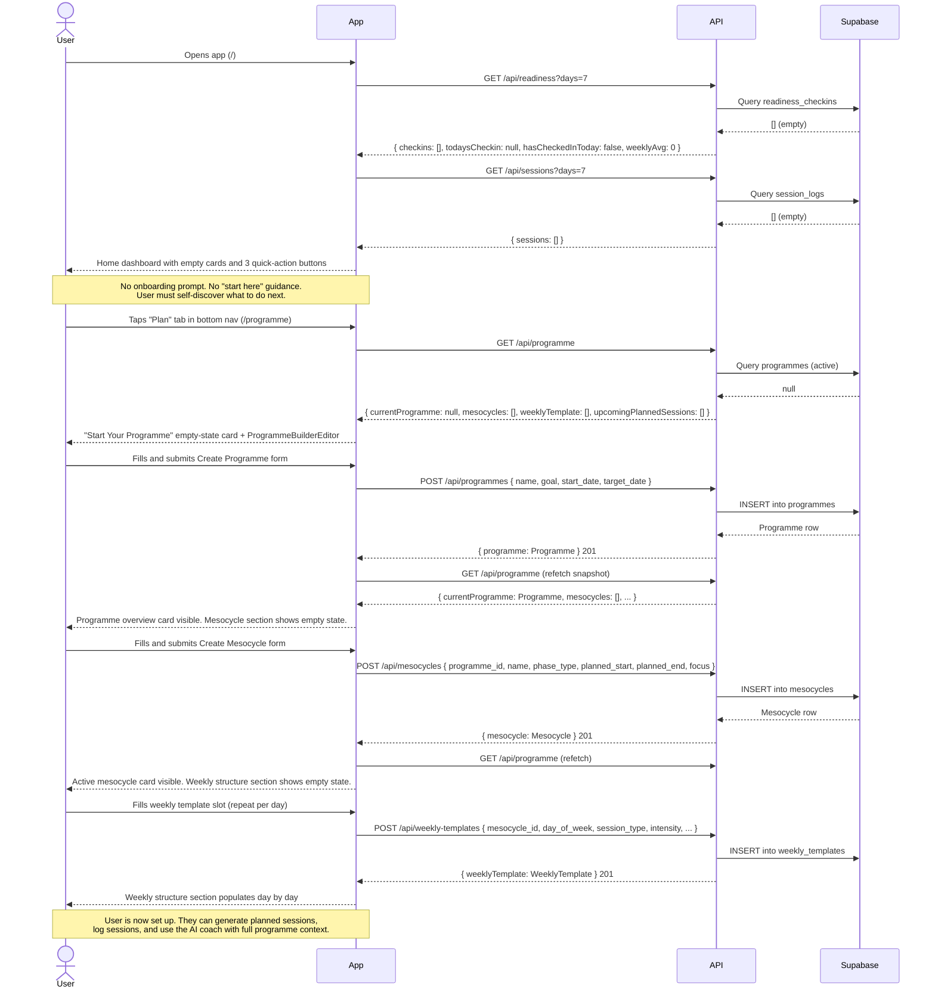

# Flow 01: First-Time Setup

## Overview

A brand new user arrives at the application with an empty database. No programme, no sessions, no readiness data, no injury areas. This flow documents what they currently encounter and what guidance (if any) exists to get them to a usable state.

There is no dedicated onboarding screen. The home page renders regardless of whether any data exists, and the app relies on the user discovering each section via the bottom navigation.

---

## Sequence diagram

---

## Journey map

| Stage | User action | System response | Friction / gap |
|---|---|---|---|
| **Land on app** | Opens app for the first time | Home dashboard renders with empty readiness and sessions cards, 3 quick-action buttons | No greeting, no setup prompt, no "what to do first" signal. The empty cards look like broken UI rather than an intentional empty state. |
| **Explore navigation** | Taps through bottom nav tabs to understand the app | Each page renders independently, most show empty states without explanation | 7 nav tabs with no hierarchy or suggested starting order. Profile, Plan, History, Chat, Check-in, Log are all equally prominent. |
| **Discover programme builder** | Taps "Plan" tab | Empty-state card with brief explanation text and the builder form | The empty-state text references "Phase 2C" and internal build notes — this is developer-facing, not user-facing copy. |
| **Create programme** | Fills name, goal, start date, target date | Programme created; page reloads showing overview | No validation that target_date is after start_date. No suggested programme duration or goal examples to help the user know what to write. |
| **Create mesocycle** | Fills mesocycle details in the inline editor | Mesocycle created; weekly structure section appears empty | Phase type options (base, power, power_endurance, etc.) have no explanatory tooltips. New users may not know what these mean. |
| **Define weekly structure** | Adds template slots one day at a time | Each slot appears in the weekly structure card | No indication of how many slots are needed, or that sessions won't generate without this step. No "add all days at once" affordance. |
| **Ready to use** | App is now set up | Programme, mesocycle, and weekly template exist; AI coach has full context | No confirmation or "you're ready to go" signal. User doesn't know the setup is complete. |

---

## Gap summary

- **No onboarding flow.** A new user opening the app for the first time has no guided path. The home page renders with empty states that communicate nothing about what to do first.
- **Developer copy in the empty state.** The "Start Your Programme" card references internal phase labels ("Phase 2C is now live in-app"). This needs to be replaced with user-facing copy before the app is shared with anyone other than the developer.
- **Invisible dependency chain.** The user must complete programme → mesocycle → weekly template before session generation works. This sequence is not communicated anywhere. A user who skips directly to "Generate sessions" gets no result and no explanation.
- **No progress indicator.** There is no visual indication of how far through setup the user is, or what step comes next.
- **Phase type jargon.** Mesocycle phase types (base, power_endurance, climbing_specific, etc.) are shown as raw enum values with no explanation. Meaningful to an experienced athlete; opaque to anyone else.
