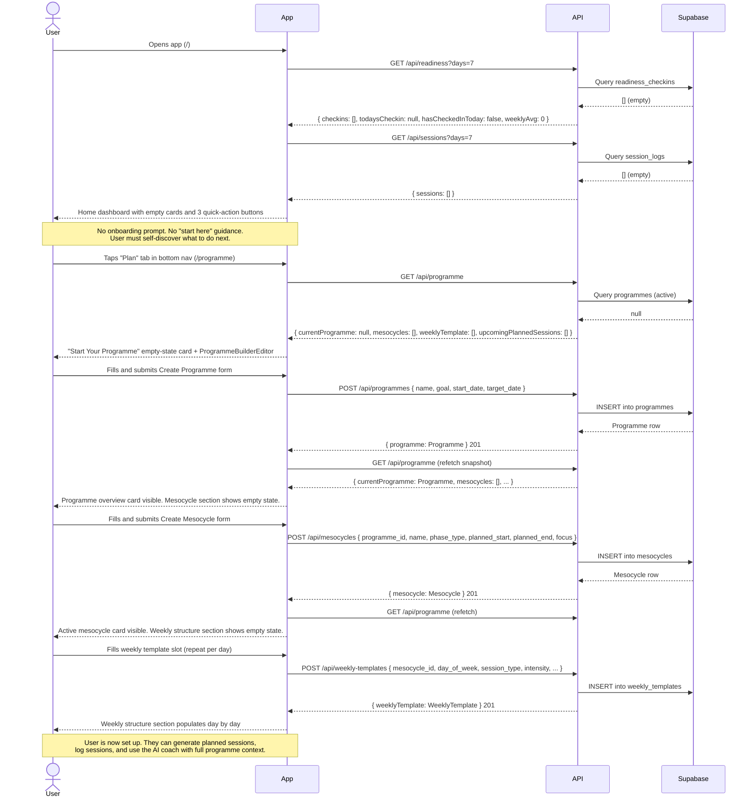

# Flow 01: First-Time Setup

## Overview

A brand new user arrives at the application with an empty database. No programme, no sessions, no readiness data, no injury areas. This flow documents what they currently encounter and what guidance (if any) exists to get them to a usable state.

There is no dedicated onboarding screen. The home page renders regardless of whether any data exists, and the app relies on the user discovering each section via the bottom navigation. Once the user reaches `/programme`, a "Getting started" step indicator guides them through the four-step setup sequence.

---

## Sequence diagram

---

## Journey map

| Stage | User action | System response | Friction / gap |
|---|---|---|---|
| **Land on app** | Opens app for the first time | Home dashboard renders with empty readiness and sessions cards, 3 quick-action buttons | No greeting, no setup prompt, no "what to do first" signal. The empty cards look like broken UI rather than an intentional empty state. |
| **Explore navigation** | Taps through bottom nav tabs to understand the app | Each page renders independently, most show empty states without explanation | 7 nav tabs with no hierarchy or suggested starting order. Profile, Plan, History, Chat, Check-in, Log are all equally prominent. |
| **Discover programme builder** | Taps "Plan" tab | Empty-state card with user-facing explanation and the builder form | ~~Developer copy~~ resolved — the empty state now explains the value proposition rather than referencing internal build phases. |
| **Create programme** | Fills name, goal, start date, target date | Programme created; page reloads showing overview card and "Getting started" step indicator | "Getting started" step indicator now shows 4 steps with checkmarks, highlighting step 2 as active. No validation that target_date is after start_date. |
| **Create mesocycle** | Fills mesocycle details in the inline editor | Mesocycle created; step indicator advances to step 3 | Phase type options (base, power, power_endurance, etc.) have no explanatory tooltips. |
| **Define weekly structure** | Adds template slots one day at a time | Each slot appears; step indicator advances to step 4 ("Generate sessions") | "Generate Week Sessions" button is now disabled with an explanatory message until at least one slot exists. |
| **Ready to use** | Generates sessions; step indicator shows all 4 steps complete and hides | Planned sessions appear; "Getting started" card is no longer shown | The step indicator disappearing is the implicit "setup complete" signal. |

---

## Gap summary

### Resolved
- ~~**Developer copy in the empty state.**~~ The "Start Your Programme" card now shows user-facing copy explaining the purpose of programme setup.
- ~~**Invisible dependency chain.**~~ A "Getting started" step indicator on `/programme` shows all four setup steps (programme → mesocycle → weekly template → generate sessions), with each step completing as the user progresses. The generate button is disabled with an explanatory message until at least one template slot exists.
- ~~**No progress indicator.**~~ The step indicator provides visual progress through setup and disappears once all four steps are complete.

### Open
- **No onboarding flow from the home screen.** A new user opening the app sees empty cards with no prompt to start at `/programme`. The guidance only appears once they discover the Plan tab.
- **Phase type jargon.** Mesocycle phase types (base, power_endurance, climbing_specific, etc.) are displayed without descriptions. Tooltips or inline explanations would lower the barrier for athletes unfamiliar with periodisation terminology.
