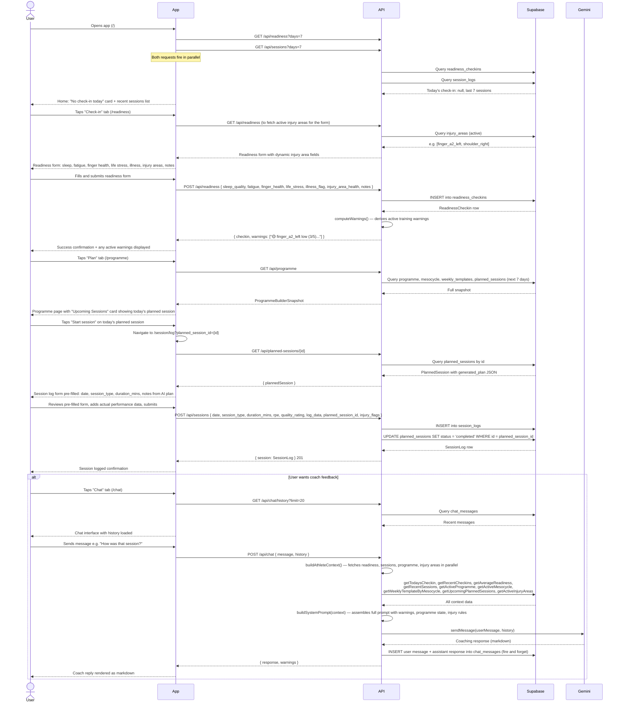

# Flow 02: Daily Training Loop

## Overview

A returning user who has a programme set up and planned sessions generated. This is the most frequent interaction with the app — the athlete opens it on a training day, checks in, sees what's planned, logs the session, and optionally talks to the coach. This flow should be fast and low-friction; it is the core daily habit the app is trying to support.

**Preconditions:** programme created, active mesocycle exists, weekly template defined, planned sessions generated for the current week.

---

## Sequence diagram

---

## Journey map

| Stage | User action | System response | Friction / gap |
|---|---|---|---|
| **Open app** | Opens app on a training day | Home dashboard: empty check-in card, last few sessions listed | Home page doesn't show today's planned session. The most important piece of information for a training day is one tap away but not on the home screen. |
| **Submit check-in** | Navigates to /readiness, fills form | Form renders with dynamic injury area fields; warnings returned on submit | Warnings appear briefly after submit but aren't persisted visibly. If the user navigates away, they won't see the warnings again without re-submitting or going to Chat. |
| **Find today's session** | Navigates to /programme | Full programme snapshot loaded; upcoming sessions card visible | The user must navigate to the Plan tab — a second tap after opening the app — to see what they're doing today. There is no "today" view. |
| **Start the session** | Taps "Start session" | Navigated to /session/log with planned_session_id in URL | Pre-fill depends on the planned session having a `generated_plan` JSON. If the session was created manually without AI generation, the form pre-fills minimally. |
| **Log the session** | Reviews pre-fill, adds performance data, submits | Session logged; planned session marked completed | The `log_data` structured fields (problems, sets, exercises) are form arrays that require multiple taps per entry. On mobile this is slow for sessions with many problems/sets. |
| **Chat with coach** | Navigates to /chat, asks about the session | AI coach has full context (today's log, readiness, warnings); responds in markdown | The coach doesn't proactively acknowledge the session just logged — the user has to initiate. There's no "session complete" prompt or automatic debrief. |

---

## Gap summary

- **No "today" view.** The home dashboard does not show today's planned session. A user on a training day must visit both `/readiness` and `/programme` before starting — the two most important pieces of daily context are on separate pages with no connection between them.
- **Warnings are transient.** Active warnings are returned by `POST /api/readiness` and `POST /api/chat` but are not persistently visible. A user who submits a check-in and then navigates away loses the warning context unless they open the chat.
- **No session debrief prompt.** After logging a session, there's no nudge to review it with the coach. The coach's value is highest immediately after a session (while it's fresh) but nothing connects the log confirmation screen to the chat.
- **Log_data entry is verbose on mobile.** The structured data forms (problems, sets) require multiple taps per entry. The programme builder editor is explicitly "laptop-optimized" — the session log form has the same issue on mobile.
- **Chat context lag.** The coach context is rebuilt on every request from Supabase. If the user logs a session and immediately opens chat, the session will be in context — but the sequence is not communicated to the user.
