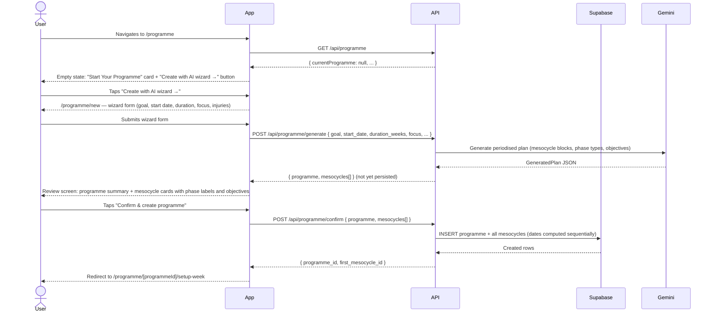

# Flow 03: Programme & Mesocycle Setup

## Overview

A user who wants to set up a structured training programme. The flow has two decoupled phases:

1. **Programme + mesocycle creation** — use the AI wizard (`/programme/new`) to generate a full periodised plan from a goal description, or build manually block by block via the inline editor on `/programme`.
2. **Weekly schedule setup** — for each mesocycle, configure the weekly session structure on `/programme/[programmeId]/setup-week`. This is a separate step so the athlete only configures the schedule they're about to start, not all future blocks at once.

After weekly setup completes, planned session records for the full mesocycle are auto-created. AI plan text for each session is generated lazily on first access (see Flow 04).

**Preconditions:** none — this is the starting point for a new user or when beginning a new training programme.

---

## Phase A: Programme + mesocycle creation (AI wizard)



---

## Phase B: Weekly schedule setup

```mermaid
sequenceDiagram
    actor User
    participant App
    participant API
    participant Supabase
    participant Gemini

    Note over User,App: Arrived from wizard confirm, or from the "Set up your training week" CTA on /programme

    App->>API: GET /api/mesocycles?programme_id={id}
    API->>Supabase: Query mesocycles
    Supabase-->>API: Mesocycle list
    App->>API: GET /api/weekly-templates?mesocycle_id={id} (for each candidate)
    API-->>App: First mesocycle with no weekly templates
    App-->>User: Weekly schedule form: available days, session duration, preferred styles, day preferences

    User->>App: Selects preferences + optional day pins (style → day, lock toggle)
    User->>App: Taps "Generate weekly plan →"
    App->>API: POST /api/mesocycles/{id}/generate-weekly { available_days, preferred_duration_mins, preferred_styles, day_pins }
    API->>Gemini: Generate weekly slot arrangement respecting locked day pins
    Gemini-->>API: GeneratedWeeklyTemplate[]
    API-->>App: Suggested weekly slots (not yet persisted)
    App-->>User: Tap-to-place review board: days of week × session palette; locked slots pinned

    User->>App: Rearranges slots by tapping (pick up, place, remove)
    User->>App: Taps "Save weekly plan"
    App->>API: POST /api/mesocycles/{id}/confirm-weekly { slots }
    API->>Supabase: DELETE existing weekly_templates for mesocycle; INSERT new slots
    Supabase-->>API: Created rows
    API-->>App: { count } 201

    App->>API: POST /api/planned-sessions/generate
    API->>Supabase: getActiveMesocycle, getWeeklyTemplateByMesocycle
    loop For each template slot × each weekly occurrence until mesocycle end
        API->>Supabase: INSERT planned_session { session_type, planned_date, generated_plan: metadata only }
    end
    API-->>App: { plannedSessions[] }
    App-->>User: Redirect to /programme
    App-->>User: Upcoming sessions card populated (next 7 days shown by default)
```

---

## Journey map

| Stage | User action | System response | Friction / gap |
|---|---|---|---|
| **Arrive at programme page** | Taps "Plan" tab | Empty-state card with "Create with AI wizard →" button and inline manual editor | — |
| **AI wizard: goal form** | Fills goal, start date, duration, focus, optional injuries | Form submitted; loading screen shown while Gemini generates plan | No streaming — user waits for the full response (~3–5 s). |
| **AI wizard: review** | Reviews mesocycle cards with objectives | Each block shows phase type, duration, focus, and objectives text | User cannot edit individual block dates or reorder blocks on the review screen. |
| **AI wizard: confirm** | Taps "Confirm & create programme" | Programme and all mesocycles created; redirected to weekly setup | — |
| **Weekly setup: preferences** | Selects available days and training styles | Form validates; must select ≥1 day and ≥1 style before generating | Day preference locks are optional but subtle — icon-based with no tooltip. |
| **Weekly setup: review board** | Rearranges slots on tap-to-place board | Locked slots cannot be moved; unplaced slots shown in palette | No undo. Tapping a placed slot picks it back up; tapping the board discards the held slot if the day is empty. |
| **Weekly setup: save** | Taps "Save weekly plan" | Templates saved; planned sessions auto-created for full mesocycle; redirected to /programme | The saving screen ("Saving your plan…") covers session record creation — currently no feedback that sessions were created. |
| **Manual setup (fallback)** | Uses inline editor on /programme to add mesocycles and template slots manually | Works as before; "Set up your training week" CTA appears when mesocycle exists but has no templates | Manual flow bypasses the wizard but session auto-creation still triggers after confirm-weekly. |

---

## Gap summary

### Resolved
- ~~**No guided setup path.**~~ The AI wizard generates a full periodised plan from a goal description in one step, replacing the blank-slate manual flow.
- ~~**Step 4 (generate sessions) was a separate manual action.**~~ Planned session records are now created automatically after weekly setup completes — no user action required.
- ~~**AI generation was slow and wasteful.**~~ Session AI plans are generated lazily on first access, not upfront. Setup is now fast regardless of mesocycle length.

### Open
- **Wizard review screen is read-only.** The user cannot edit block dates, reorder mesocycles, or adjust durations after the AI generates the plan. They must regenerate or use the manual editor after confirming.
- **Phase type jargon unexplained.** `base`, `power`, `power_endurance`, `climbing_specific`, `performance`, `deload` are shown with a label but no inline description. Tooltips would lower the barrier for athletes unfamiliar with periodisation terminology.
- **Only the first mesocycle is set up.** The setup-week page targets the first mesocycle without weekly templates. Future mesocycles require the user to return to `/programme/[id]/setup-week` when they become active — there is no prompt to do this.
- **No date validation between layers.** Mesocycle dates can fall outside the programme dates without error.
