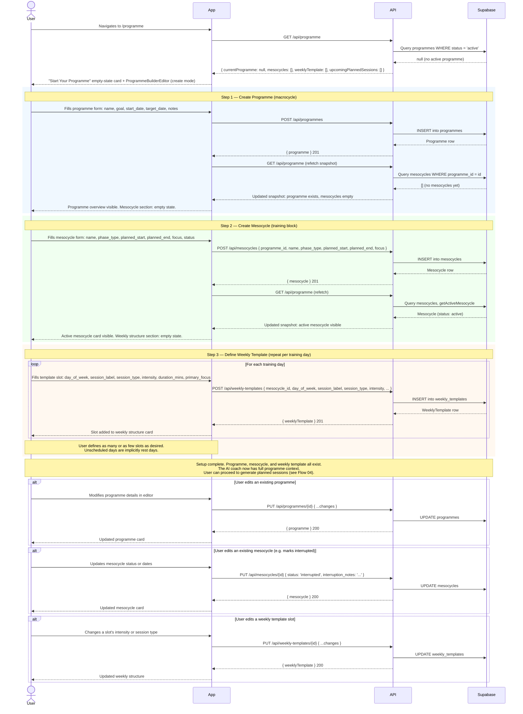

# Flow 03: Programme & Mesocycle Setup

## Overview

A user who wants to set up a structured training programme. This flow covers creating the macrocycle (programme), defining training blocks within it (mesocycles), and building the weekly session template for the active mesocycle. All three steps must be completed before the AI can generate meaningful planned sessions.

This flow all takes place on a single page (`/programme`) via an inline editor. The entire setup is done in-app — no manual database population or dev seeding is needed in production.

**Preconditions:** none — this is the starting point for a new user or when beginning a new training programme.

---

## Sequence diagram

---

## Journey map

| Stage | User action | System response | Friction / gap |
|---|---|---|---|
| **Arrive at programme page** | Taps "Plan" tab | Empty-state card with create form visible | Empty-state copy references internal build phase labels, not user-facing language. |
| **Create programme** | Fills name, goal, dates | Programme created; page reloads showing overview card | No suggested goal templates or examples. `target_date` has no validation against `start_date`. Status is not shown — the user doesn't know the programme is now "active". |
| **Add first mesocycle** | Fills mesocycle details | Mesocycle created; weekly structure section appears | `phase_type` enum values have no descriptions or guidance. The user must know what "power_endurance" means in a climbing context. `planned_start` / `planned_end` have no validation against the programme dates. |
| **Build weekly template** | Adds slots one by one | Each slot appears in the weekly structure card | No bulk-add. Adding a 4-day training week requires 4 separate form submissions. There is no indication that sessions won't generate without at least one slot. |
| **Edit existing setup** | Changes a mesocycle's status to 'interrupted' | Update applied | `interruption_notes` is a free-text field with no prompt. The coach uses this field in the prompt — its value matters — but the user has no guidance on what to write. |
| **Setup complete** | No explicit completion step | Weekly structure card shows defined slots | No "setup complete" signal. No confirmation that the AI coach now has full context. The transition from "set up" to "ready to use" is invisible. |

---

## Gap summary

- **No step-by-step progression.** The three-step sequence (programme → mesocycle → weekly template) is not communicated as a sequence. Each step reveals the next only after the previous is submitted — a breadcrumb trail rather than a plan.
- **Phase type jargon unexplained.** `base`, `power`, `power_endurance`, `climbing_specific`, `performance`, `deload` are displayed as raw enum values. A new user has no idea what these mean. Tooltips or a short description alongside each option would significantly lower the barrier.
- **No date validation between layers.** A mesocycle's `planned_start`/`planned_end` can fall outside the programme's `start_date`/`target_date` without any error. Similarly, a programme's `target_date` can precede its `start_date`.
- **No "you're set up" confirmation.** After defining the weekly template, there is no feedback that setup is complete and the user can now generate sessions. The next step (generating sessions) is on the same page but not visually connected to the template setup.
- **Editing a mesocycle status is undiscoverable.** Marking a mesocycle as `interrupted` is possible via the inline editor but requires the user to find the status field. There is no prominent "interrupt this block" or "start a new block" action.
- **Multiple mesocycles per programme.** The data model supports multiple mesocycles per programme (one per training block), but the UI currently shows only the active one. A user working through a multi-block programme has no overview of the full structure.
