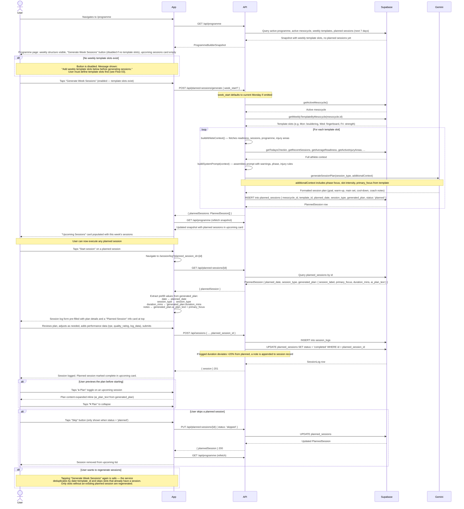

# Flow 04: Weekly Session Planning

## Overview

A user who has a programme, active mesocycle, and weekly template set up, and wants to generate planned sessions for the coming week. The AI uses the weekly template (session types, intensity, duration) and the current athlete context (readiness trend, recent load, programme phase) to produce a detailed session plan for each scheduled day. The user then executes those plans by tapping "Start session" from the programme page.

**Preconditions:** active programme, active mesocycle with status `active`, at least one weekly template slot defined for the mesocycle.

---

## Sequence diagram

---

## Journey map

| Stage | User action | System response | Friction / gap |
|---|---|---|---|
| **View programme page** | Navigates to /programme | Snapshot loaded; weekly template visible; "Generate Week Sessions" button — disabled with message if no template slots | ~~Button had no guard~~ — resolved. Button is now disabled with explanatory message when no template slots exist. |
| **Generate sessions** | Taps "Generate Week Sessions" | API calls Gemini once per template slot; sessions created and appear in upcoming card | Generation can take several seconds (one Gemini call per slot, sequential). No visible progress indicator — the button shows "Generating sessions..." but the page otherwise appears static. |
| **Review generated sessions** | Sees upcoming sessions list | Each session shown with date, type, status badge, "▸ Plan" toggle, "Skip" button, and "Start session" button | ~~Plan content hidden until session start~~ — resolved. "▸ Plan" toggle shows the full `ai_plan_text` inline without committing to start the session. |
| **Skip a session** | Taps "Skip" button | Session status updated to 'skipped'; removed from upcoming list after snapshot refetch | ~~No skip affordance~~ — resolved. Skip button is shown for any session with status 'planned'. No reschedule affordance — skipped sessions cannot be moved to another date. |
| **Start a session** | Taps "Start session" | Navigated to /session/log with plan pre-filled | Pre-fill injects plan text into the notes field as a single block. The structured sections (warm-up / main set / cool-down) lose their formatting in the text area. |
| **Log the session** | Adds performance data alongside pre-filled content | Session logged; planned session marked completed | No way to flag "I changed this significantly". Duration deviation >20% appends a note, but no "modified" status is set. |
| **Session complete** | Returns to home or programme page | Session shown in last-session card on home; planned session marked completed | No session debrief prompt. The link between "session done" and "ask the coach about it" is not made explicitly. |

---

## Gap summary

### Resolved
- ~~**No guard against generating when no template exists.**~~ "Generate Week Sessions" is now disabled when `currentWeeklyTemplate.length === 0`, with an explanatory message: "Add weekly template slots below before generating sessions."
- ~~**No deduplication on regeneration.**~~ `sessionGenerator.ts` already deduplicates by `date:template_id` key — confirmed during audit. Pressing "Generate Week Sessions" again is safe and only creates sessions for slots that don't already have one.
- ~~**Generated plan content is hidden until session start.**~~ A "▸ Plan" toggle on each upcoming session card shows the `ai_plan_text` inline without navigating away.
- ~~**No skip affordance.**~~ A "Skip" button now appears on any planned session with status `'planned'`. Tapping it sets status to `'skipped'` and refreshes the snapshot.

### Open
- **Session plan displayed as a text block.** The `ai_plan_text` is injected into the session log notes field as plain text. The structured sections (goal, warm-up, main set, cool-down, coach notes) lose their formatting in the textarea.
- **No reschedule affordance.** Skipped sessions cannot be moved to another date. There is no "move to tomorrow" or "reschedule" action.
- **No way to regenerate a single session.** If one day's plan is inappropriate, the user must skip it and manually log a different session. There is no "regenerate this session" action.
- **Sequential Gemini calls, no progress feedback.** For a 5-day training week, generation makes 5 sequential Gemini calls. The button label changes to "Generating sessions..." but no per-slot progress is shown.
