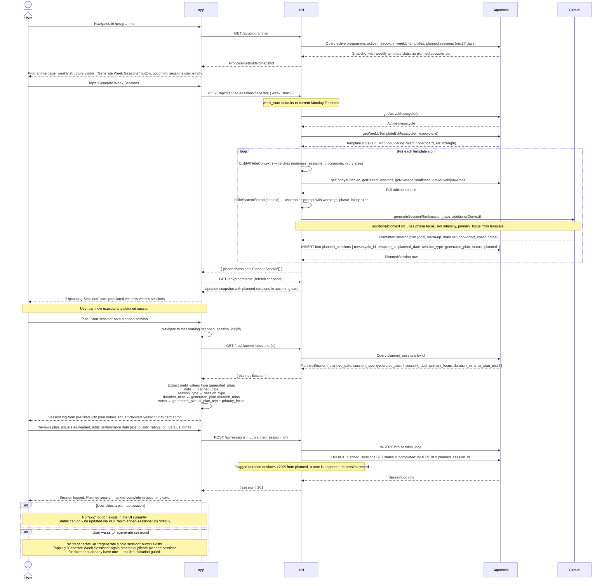

# Flow 04: Weekly Session Planning

## Overview

A user who has a programme, active mesocycle, and weekly template set up, and wants to generate planned sessions for the coming week. The AI uses the weekly template (session types, intensity, duration) and the current athlete context (readiness trend, recent load, programme phase) to produce a detailed session plan for each scheduled day. The user then executes those plans by tapping "Start session" from the programme page.

**Preconditions:** active programme, active mesocycle with status `active`, at least one weekly template slot defined for the mesocycle.

---

## Sequence diagram

---

## Journey map

| Stage | User action | System response | Friction / gap |
|---|---|---|---|
| **View programme page** | Navigates to /programme | Snapshot loaded; weekly template visible; "Generate Week Sessions" button shown | Button is visible even if no weekly template slots exist — pressing it then silently produces nothing. |
| **Generate sessions** | Taps "Generate Week Sessions" | API calls Gemini once per template slot; sessions created and appear in upcoming card | Generation can take several seconds (one Gemini call per slot, sequential). No loading indicator beyond the browser default. If the mesocycle has 5 slots, 5 sequential API calls are made. |
| **Review generated sessions** | Sees upcoming sessions list | Each session shown with date, session type, and status badge | The generated plan content (the actual warm-up, main set, coach notes) is not visible on the programme page. The user cannot review or approve the plan before starting it. |
| **Start a session** | Taps "Start session" | Navigated to /session/log with plan pre-filled | Pre-fill populates the notes field with the AI plan text as a single block — there's no structured display of warm-up / main set / cool-down sections in the form. |
| **Log the session** | Adds performance data alongside the pre-filled content | Session logged; planned session marked completed | No way to record "I modified the session significantly" — the deviation note only fires on duration variance >20%. No "modified" status is set automatically. |
| **Session complete** | Returns to programme page | Completed session disappears from upcoming card (or shows as completed) | No session debrief or coach prompt. The link between "session done" and "talk to coach about it" is not made. |

---

## Gap summary

- **No guard against generating when no template exists.** The "Generate Week Sessions" button is visible regardless of whether any weekly template slots exist. Pressing it with an empty template silently returns an empty array with no error message.
- **No deduplication on regeneration.** Tapping "Generate Week Sessions" a second time for the same week creates duplicate planned sessions. There is no warning, and no existing sessions are updated or replaced.
- **Generated plan content is hidden until session start.** The user cannot see the AI-generated plan (warm-up, main set, coach notes) from the programme page. They only see it once they've committed to starting the session. There's no "preview" step.
- **Session plan displayed as a text block.** The `ai_plan_text` from `generated_plan` is injected into the session log's notes field as a single pre-filled string. The structured sections (goal, warm-up, main set, cool-down, coach notes) lose their formatting.
- **No skip or reschedule affordance.** If a user can't do a planned session, there's no "skip" or "move to tomorrow" button. The planned session stays as "planned" indefinitely. Status updates require a direct API call.
- **No way to regenerate a single session.** Regeneration is all-or-nothing for the whole week. If one day's plan is inappropriate (e.g. the AI didn't account for a recent injury), there's no way to regenerate just that session.
- **Sequential Gemini calls, no progress feedback.** For a 5-day training week, generation makes 5 sequential calls to Gemini. There is no visible progress indicator — the page appears frozen until all calls complete.
